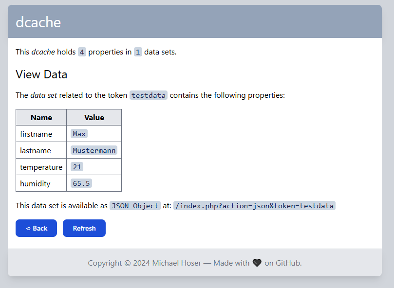

# dcache

**dcache** is a PHP REST API implementing a JSON data cache.

* The data cache consists of _data sets_ containing multiple _properties_ (as key-value-pairs).
* A _data set_ is identified by an unique _data token_.
* _Data Provider_ can create, update, and remove _data sets_.
* _Consumer_ can query a _data set_ based on a provided _data token_.

A running demo is available at: <https://dcache.schademarmelade.de/>.



Usage examples:

* Selected [Home Assistant](https:c//www.home-assistant.io/) entities can be pushed to _dcache_ and visualized on a [TRMNL](https://usetrmnl.com/) e-ink display via a [custom TRMNL-Plugin](https://help.usetrmnl.com/en/articles/9510536-custom-plugins).
* The result status of a DevOps build pipeline can be sent _dcache_ and visualized on a WLED led strip.
* The battery status of multiple IoT devices is available in a single _dcache_ data set.
* ...

A typical flow between Home Assistant, dcache, and TRMNL could look like this:

* HA provides `temperature=25`
* HA provides `humidity=65`
* TRMNL receives `{ temperature=25, humidity=65 }`
* HA provides `fan=on`
* HA provides `humidity=40`
* TRMNL receives `{ temperature=25, humidity=40, fan=on }`

## Server Setup

Simply upload the `www` folder to your PHP enabled webserver and open the related address in a browser to setup your database connection.

## Development Setup

Local development on Windows requires the following setup:

* Install Git, NodeJs and VSCode.
* Clone the GitHub repo `https://github.com/ramdacxp/dcache` in VSCode.
* Open the created local folder in VSCode and confirm the installation of all recommended extensions.
* Install PHP and MariaDB locally into a `bin` subfolder by executing `npm install`.
* Import database test data via `reset-testdata.cmd`.

The installation can be repeated by executing the related `install-xxx.cmd` batch files.
No system wide settings are modified during the installation.

The database content can be reset to the initial test data with `reset-testdata.cmd`.
Already existing data in dcache tables will be removed!

All tools can be removed safely by deleting the `bin` and `node_modules` sub-folders.

## Run dcache locally

* Execute `npm start` or choose `Terminal > Run Build Task...` in VSCode.
* Open the local dev webserver <http://localhost:8080/> in your browser.
* Stop the servers by pressing `Ctrl-C` in the Terminal window.

## Settings

If the settings file `src/settings.php` is missing, a settings form is shown on the website to interactively configure the database connection.
Simply accept the default values if using the development servers.
Once configured, the form is no longer available. To revert the configuration, the settings file `src/settings.php` needs to be removed.

The default `src/settings.php` will have the following content:

```php
<?php
$settings = [];
$settings["database"] = "mysql:host=localhost;dbname=dcache";
$settings["user"] = "root";
$settings["password"] = "";
$settings["prefix"] = "dc-";
```

## API Details

The REST API is exposed at `/api.php`.

For a list of supported requests and related responses, please refer to the [`requests.http`](./requests.http) sample file.

All requests can be executed against the provided PHP development webserver in order to test and debug the API.
This requires VSCode with the [REST Client](https://marketplace.visualstudio.com/items?itemName=humao.rest-client) extension installed.

## License

See [LICENSE](LICENSE).
